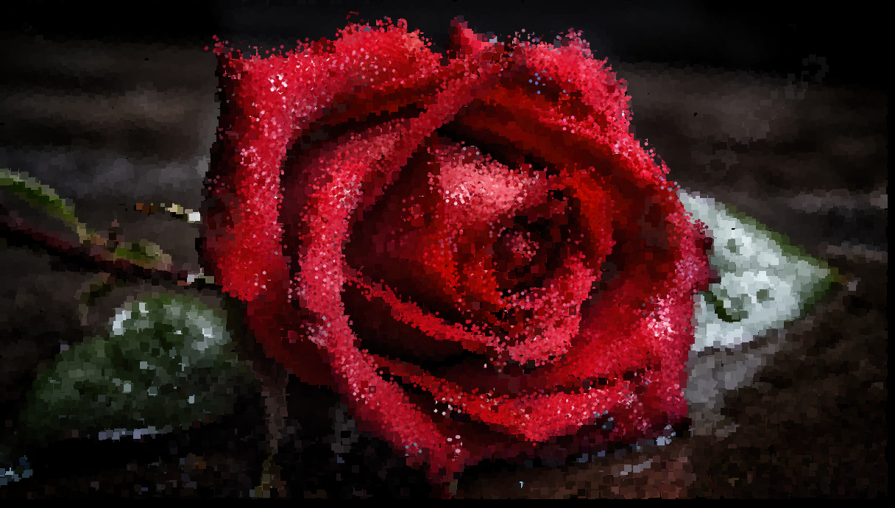

## Creative Coding 2: Custom Pixel

## Project: Now You See Me

#### Flower Idea
My project began when I wanted to create something using flowers. All of my previous design work had leaned towards a more functional style focusing on specifics over aesthetics, and I wanted to make something aesthetically pleasing. I experimented with various types of flowers and discovered that I had a fondess for roses and water lilies. However, I couldn't quite settle on a theme, and as a result, I decided to abandon this concept.

#### Eye Idea
While I was developing the flower concept, I came up with an idea centred around the theme of "we see the world differently." It thought that I could explore this idea by focusing on the iris of an eye.

I began but keeping the previous pixel design, but with a close-up of an eye instead. I applied additional effects to align with my theme. These effects included darkening all parts of the image that were not the iris to create a focal point. I also swapped the blue and red channels of the iris to create a different look compared to the original image. In doing this I discovered that the blue hue, created from the hazel image, produced excellent contrast against the background's skin tone. I slightly enhanced the red channel in the background to infuse emotion into the piece. My intention was to convey the idea that while the background appeared angry and dark, the iris, representing what a person sees, evoked contrasting emotions of calmness and brightness.

To further enhance the contrast, I drew the iris using ellipses and the background using rectangles. Circles and curves are often associated with calmer emotions, while sharp edges are linked to more intense emotions, such as anger. This choice created a geometric contrast that harmonized with the colour scheme of the image.

However, I struggled to address the slight white component that remained around the iris and in the reflective part. So, I decided to simply not draw them.

For my second attempt, I decided to redesign the iris. In this iteration, I represented each pixel as five circles arranged in a flower-like shape, drawing inspiration from the flowers I had previously explored. I made the decision to enhance the red channel for the remaining white pixels. This was particularly important for the reflective part of the eye, considering that the background had an increase red channel. So, made sense that the eye's reflection would mirror the background.

Note: The following sections will primarily focus on my design process concerning the effects applied to each pixel as the AI easily generated an iris mask and pupil mask.

##### Experiment 1: Multiple Eyes
I attempted to experiment with the concept of multiple eyes. Considering that my theme, "We see the world differently," I thought it might be interesting to capture this idea by using multiple perspectives from different eyes and merging them together. However, the result was a blurry image where only one of the multiple perspectives was noticeable. So I deemed this experiment a failure.

##### Experiment 2: Lines
For my next experiment I decided to explore textures. I began by dividing the image so that only the even vertical pixel lines were drawn. This approach created an intriguing pattern that reminded me of old box TVs, where individual pixels were visible. Since pixels are stored in rows and columns, I decided to include all even horizontal lines as well. However, as more pixels were drawn, the image started to lose the interesting texture I had intended to create. This makes sense as on average more pixels were drawn.

##### Experiment 3: Colours

I had previously played with colours in the single eye design, and I wanted to see how these colour effects would look in the multi-eye design. However, I was disappointed with how the colours overlaid in the iris creating weird edge artifacts. Since this avenue was not making any progress, I decided to drop the idea of using multiple eyes. It was also at this point that I decided to make the background more saturated.

After playing around with multiple eyes, I decided to give the background more layers of depth. This was done by increasing the red channels of brighter areas. This would have a greater impact over increasing the red channels of a dark region since it is harder to see. I also tried various coloured irises against this new background.

##### Experiment 4: Iris Texture

In my next experiment, I focused on the texture of the iris. I liked my previous idea of alternating stripes and tried to use this to help create distortion.  Intending to make the eye appear different to the world, relating to my theme of "We see the world differently." The goal was to create an iris that contrasted significantly with the background. However, instead of distortion, I ended up with a subtle shift in colour. The alternating lines consisted of blue and bright green, so it was understandable that these colours blended to form a teal hue.

Note: It's worth mentioning that the teal iris image in the readme seemed to achieve the combined effect I was aiming for. This differs from the way it's displayed in the program or photo viewing software.

Since the alternating lines didn't produce the desired result, I came up with the idea of using a single thick line at a lower frequency and leaving the remaining pixel lines at their original size to fill in the gaps. In the image that follows, the lines of the original size have had changes to their colour channels to create a purple hue, while the less frequent, thicker lines were set to the blue from previous iterations. This approach resulted in the overall iris gaining a purple tint while also producing the textured lines I had been aiming for.

To fully explore this avenue, I experimented with creating a grid instead of lines as well as an experiment without gaps for both variants. But I found I ultimately preferred the original thick lines design

##### Experiment 5: Background Texture

The main highlighted section of the background is the sclera (white part of the eye), and since the iris had a texture, I wanted to apply one to this section as well. To make it different from the iris I decided on the grid texture. However, this had less than optimal results.

My next idea was to use the iris texture by reversing the drawing order to create a different effect. I also increased the green channel for the 'filling' background pixels to contrast the 'filling' purple pixels in the iris.

Background left to right, iris right to left

Background right to left, iris left to right

Though the change is subtle, I found that I preferred the traditional way of drawing the iris from left to right, while the background is drawn in the opposite direction. This implies a hidden meaning, suggesting that most people believe they are right, and the world is wrong.

Next, I wanted to reintroduce some texture concepts from one of my original eye images. I aimed for a sharp background with clear edges, while keeping the iris smooth and curved to relate to the emotions conveyed by their respective colours. To achieve this, I modified the background to be drawn using rectangles and kept the iris as points.

##### Experiment 6: Background Colour

I aimed to infuse more anger into the piece, so I increased the saturation, slightly shifted the hue towards red, and decreased the brightness. This adjustment had a significant impact on the emotional tone of the image.

##### Experiment 7: Face

I experimented with the concept of incorporating a face, exploring the possibility of having opposing colour themes on two sides of the face. However, the results didn't turn out as well as I had hoped. As the face had a bright skin tone, with my current design that was tailored to the hazel eye image, it treated the majority of the face as background regions to highlight. As for the multiple colour themes, getting optimal colours for both themes with require handling a lot of edge cases and program reruns. This was not suitable for my current situation. So, while it was an interesting experiment, I decided not to pursue this idea. Nevertheless, it's worth noting that the AI was able to accurately capture the iris of the face without difficulty.

As mentioned earlier, the face image had a bright skin tone, which led me to modify the red highlight condition to prevent the entire face from appearing too red. However, this change negatively impacted the original hazel eye I was initially working on. It was also at this point that I addressed the excess white pixels around the iris by cleaning up the mask.

Since I had abandoned the face idea, I reverted the increased condition for the brighter sections of the background to remove the artifacts it had created.

##### Experiment 8: Eye Ring

For my next idea, I decided to introduce a white ring around the pupil, as it would enhance the visual hierarchy and create a focal point in the centre of the iris (pupil).

When I manually created a ring mask, I achieved the following result. However, when I attempted to have the AI generate a ring mask, it failed miserably and was unable to produce a ring.

Note: During development, I accidentally used the source image as the iris mask, and it unexpectedly created an interesting image that I wanted to share.

Since the AI had failed, I experimented with blurring to create the ring. Unfortunately, this method wasn't able to generate as clean a mask as the ones I had made myself. However, I was now able to generate a ring using AI-generated masks, as the AI could correctly identify the pupil, and my code could transform a pupil mask into a ring mask. During this period, one of my experiments involved using a Gaussian kernel, but as shown below, it struggled to produce a sufficiently large ring.

In the end, I decided to use the pixel values around the given pixel and averaged them to create the ring area (for a more detailed explanation, refer to the code). This approach became my final design. Despite the ring texture not blending as seamlessly with the image as I had hoped, I valued the visual hierarchy and contrast that the white ring added between itself and the background enough to keep it.

Final Design

Note: It should be noted that my design process for pixel manipulation was predominantly carried out on the hazel-eye image.

#### References:
Close-up of a blue female human eye. (2023). iStock.
https://media.istockphoto.com/id/179209374/photo/a-close-up-of-a-blue-female-human-eye.jpg?s=612x612&w=0&k=20&c=wqKmZy4pGBQxo6QAa-92AZig8IJB7neCxQ8OwmpgdYY=

Wallpaper Better. (2023). Macro view of an eye with the pupil and iris.
https://p4.wallpaperbetter.com/wallpaper/601/901/103/macro-eyes-the-pupil-iris-wallpaper-preview.jpg

Expert Photography. (2023). A close-up of an eye in macro photography.
https://expertphotography.b-cdn.net/wp-content/uploads/2019/03/macro-eye-photography-4.jpg

Vecteezy. (2023). Close-up detail of a beautiful male eye in macro photography (AI-generated photo).
https://static.vecteezy.com/system/resources/previews/024/209/366/non_2x/close-up-detail-beautiful-male-eye-macro-ai-generated-photo.jpg

Close-up of a human eye. (2023). iStock.
https://media.istockphoto.com/id/459969147/photo/eye.jpg?s=612x612&w=0&k=20&c=xECnA4nPVNSG-FNkFKJN7oGcOwVedY-tLCAVecY04nQ=